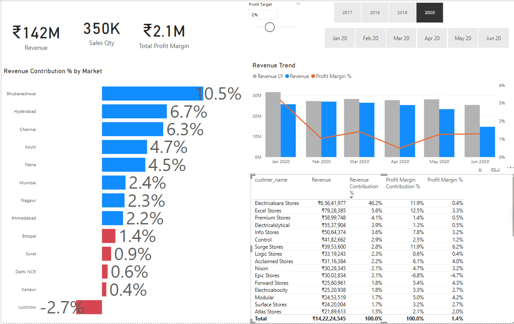

# 📊 Sales Insights Dashboard using Power BI

A self-driven data analytics project focused on analyzing business performance using Power BI and SQL. The goal was to transform raw data into actionable insights through an interactive dashboard.

---

## 🧠 Problem Statement

**AtliQ Hardware**, a computer hardware distributor across India, faced:

- Declining sales
- Difficulty in interpreting raw Excel data
- Inability to make data-driven decisions

---

## ✅ Solution

Developed a **Sales Insights Dashboard** using Power BI to convert complex transactional data into easy-to-understand visuals. Enabled the sales director and regional managers to analyze performance without relying on spreadsheets.

---

## 🎯 Project Planning (AIMS Grid)

- **Audience**: Sales leadership team
- **Intent**: Visualize sales, revenue, and profit KPIs
- **Means**: SQL (MySQL), Power BI, Power Query
- **Success**: Clear, visual insights for strategic decision-making

---

## 🔄 Steps Followed

1. Created project scope using AIMS Grid
2. Connected MySQL database to Power BI
3. Cleaned and transformed data using Power Query
4. Applied DAX for KPI calculations
5. Modeled the data with relationships and measures
6. Handled multiple currencies via conversion logic
7. Built interactive dashboards with slicers, charts, and tables

---

## 🔧 Custom Enhancements

- Solved “(Blank)” product issue by adding missing products (Prod280–Prod339)
- Merged additional fields into the `sales_transaction` table (e.g., cost price, profit margin)

---

## 📊 Key Insights

- **Total Revenue** (4 Years): ₹985M
- **Profit Margin**: ₹24.7M (2.5%)
- **Sales Qty**: ₹2M
- **Revenue in 2020**: ₹142M (350K units sold, ₹2.1M profit)

### Market Performance:

- **Delhi NCR**: ₹520M revenue but low margin (2.3%)
- **Bhubaneshwar (2020)**: Highest margin (10.5%)
- **Mumbai**: Top profit contributor (23.9%)
- **Bengaluru**: Lowest profit margin (-20.8%)

### Top Customers and Products:

- **Customer**: Electricalsara Stores – ₹413M revenue
- **Product**: Prod318 – ₹69M revenue
- **Product Type**: Distribution & Own Brand – ₹494M each

---

## 📈 Dashboard Screenshots

### KPI & Market Overview

### Profitability & Market Trends

### Monthly Profit Margin Breakdown

---

## 📚 Key Learnings

- SQL for real-world business datasets
- Data transformation in Power BI (Power Query)
- DAX functions and advanced measures
- Storytelling through dashboard design

---

## 🏁 Final Deliverables

- **KPI Overview Page**
- **Performance Insights Dashboard**
- **Profit Margin Analysis**
